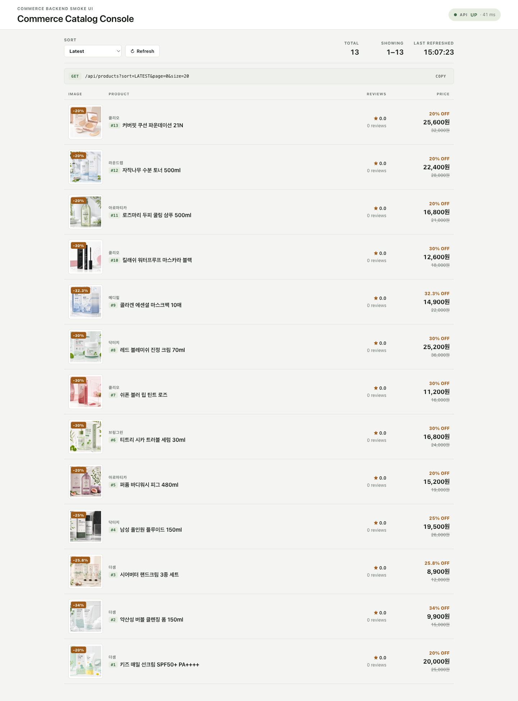

# Health & Beauty Commerce

Production-style shopping mall built around health and beauty commerce
workflows: a Spring Boot modular-monolith backend paired with a React storefront
SPA. The project demonstrates the architecture behind a modern catalog, cart,
order, payment, inventory, delivery, review, search, and operations stack, plus
the customer-facing storefront that drives it.

This is an educational portfolio project. It is not affiliated with, endorsed by,
or connected to any retailer or beauty brand. Demo catalog data and product
images are for local development and portfolio presentation only.



## What This Shows

Storefront (React SPA at `/app`):

- Anonymous browse to checkout: catalog, product detail, cart, login with
  anonymous-cart merge, order creation, mock payment, and order complete
- Wishlist, my page (points, coupons, order summary), order history, and search
  with filters
- Single-flight token refresh so an expired session recovers instead of silently
  logging out

Backend (Spring Boot modular monolith):

- Public catalog API, OpenAPI 3 contract / Swagger UI, and a Thymeleaf smoke
  console at `/products`
- Product, brand, category, option, image, and inventory domain modeling
- Member signup/login with JWT access and refresh tokens
- Cart, order creation, cancellation, payment confirmation, refunds, and mock PG
  webhooks
- Delivery lifecycle with carrier retry handling
- Purchase-verified reviews and review aggregate updates
- OpenSearch product indexing, public search, autocomplete, and popular keywords
- Outbox-based async indexing and failure retry behavior
- Batch jobs, job admin endpoints, sales summary tables, and scheduler locking
- Token-bucket rate limiting on public auth, catalog, and search endpoints
- Actuator health groups, Prometheus metrics, Grafana dashboard provisioning, and
  k6 load-test scripts
- Testcontainers-backed integration tests across Postgres, Redis, LocalStack S3,
  and OpenSearch

## Tech Stack

This repository pairs a backend-heavy commerce system with a real storefront SPA,
not a static mock. The React storefront and the legacy Thymeleaf console both call
the same public product API, while the backend keeps realistic infrastructure
boundaries for data, cache, search, files, observability, and async work.

| Layer | What is used | How it is used in this project |
| --- | --- | --- |
| Language and build | Java 21, Gradle Kotlin DSL, Spring Boot Gradle plugin | Java 21 is the runtime baseline; Gradle wrapper builds, tests, and runs custom boot tasks such as `reindexProducts`. |
| Application framework | Spring Boot 3.3, Spring MVC, Bean Validation | REST controllers, request validation, service wiring, configuration properties, and local command-style tasks. |
| Storefront SPA | React 18, Vite 5, TypeScript, React Router 6, TanStack Query 5 | The customer storefront served at `/app`: browse, cart, anonymous-cart merge on login, checkout, order tracking, wishlist, my page, and search. Vite builds it into `static/app`, and the boot jar packages it for self-contained runs. |
| Server-side UI | Thymeleaf, static CSS/JS | `/products` is a smoke catalog console that loads data from `/api/products` and renders seeded product images. |
| API documentation | springdoc-openapi, Swagger UI | OpenAPI 3 contract the storefront SPA consumes; browsable at `/swagger-ui.html` with JSON at `/v3/api-docs`. |
| Security | Spring Security, OAuth2 Resource Server, Nimbus JOSE JWT | JWT-protected member/admin APIs with local RS256 signing keys for development. |
| Edge protection | Bucket4j | Token-bucket rate limiting on public auth, catalog, and search endpoints. |
| Database | PostgreSQL 16 | Source of truth for products, members, carts, orders, payments, inventory, delivery, reviews, promotions, batch runs, and outbox rows. |
| Migrations | Flyway 10 | Versioned schema and seed migrations, including the 13-product demo catalog and local image URL migration. |
| ORM and repositories | Spring Data JPA, Hibernate | Domain repositories and entity mapping for the modular monolith. |
| Cache and distributed coordination | Redis, Redisson, ShedLock JDBC provider | Catalog cache behavior, inventory/scheduler locking, and safe scheduled job execution. |
| Search | OpenSearch Java client, OpenSearch REST client | Product indexing, search, autocomplete, popular keywords, and a rebuild task from Postgres. |
| Async consistency | Transactional outbox table, index worker | Product changes are recorded in Postgres first, then retried into OpenSearch without losing source data. |
| Object storage | AWS SDK for Java S3 client, LocalStack | S3-compatible local image/upload flows without needing a cloud account. |
| Observability | Actuator, Micrometer, Prometheus, Grafana, logstash-logback-encoder | Health groups, Prometheus metrics, provisioned dashboard, alert rules, and structured logging. |
| Testing | JUnit 5, MockMvc, Spring Security Test, Spring Boot Test, Testcontainers | Controller/service tests and integration tests with real Postgres, Redis, LocalStack, and OpenSearch containers. |
| Load testing | k6 | Product-list and order-create scripts under `infra/k6`. |
| Local runtime | Docker Compose | One-command local dependencies for Postgres, Redis, LocalStack, OpenSearch, Prometheus, and Grafana. |

More detail: [docs/TECH_STACK.md](docs/TECH_STACK.md)

## Quick Start

Prerequisites:

- Docker Desktop or a Docker-compatible runtime
- JDK 21. The Gradle wrapper is included, so no system Gradle install is needed.
- Node.js 20+ and npm. `bootRun` and `bootJar` build the storefront SPA via Vite.
- OpenSSL for generating local JWT signing keys

Generate local development JWT keys. These files are intentionally ignored by
Git.

```bash
mkdir -p src/main/resources/keys
openssl genpkey -algorithm RSA -out src/main/resources/keys/app.key -pkeyopt rsa_keygen_bits:2048
openssl rsa -in src/main/resources/keys/app.key -pubout -out src/main/resources/keys/app.pub
```

Start local infrastructure.

```bash
docker compose up -d postgres redis localstack opensearch
```

Run the app.

```bash
./gradlew bootRun --args='--spring.profiles.active=local'
```

Open the demo:

- Storefront SPA: http://localhost:8080/app
- API docs (Swagger UI): http://localhost:8080/swagger-ui.html
- Thymeleaf catalog console: http://localhost:8080/products
- Product API: http://localhost:8080/api/products?size=20
- Search API: http://localhost:8080/api/search/products?keyword=%EC%84%A0%ED%81%AC%EB%A6%BC&page=0&size=5
- Health: http://localhost:8080/actuator/health
- Prometheus metrics: `/actuator/prometheus` is protected by the app security
  filter. Scrape it with credentials or adjust local security for a metrics-only
  demo.

Populate OpenSearch after the app and OpenSearch are running:

```bash
./gradlew reindexProducts --args='--spring.profiles.active=local,reindex --server.port=8082'
```

## Storefront SPA

The React storefront lives in `frontend/` and is served by Spring Boot at `/app`.
`./gradlew bootRun` and `./gradlew bootJar` build it automatically (Vite output
goes to `src/main/resources/static/app`), so the packaged jar is self-contained.

For frontend iteration, run the Vite dev server with hot reload. It proxies
`/api` to the backend on `:8080`:

```bash
cd frontend
npm install
npm run dev      # http://localhost:5173/app
```

Type-check the storefront without emitting a build:

```bash
npm run typecheck
```

## Local Demo Data

Flyway migrations seed a small health and beauty catalog with 13 products across
skincare, makeup, and hair/body categories. This keeps the UI useful on a fresh
local database without requiring external fixtures. Demo product images are
checked in as local static assets, so the catalog renders without external image
hosting.

More detail: [docs/LOCAL_DEMO.md](docs/LOCAL_DEMO.md)

## Running Tests

```bash
./gradlew test
```

The suite uses Testcontainers. Docker must be running.

## Architecture

The service is a modular monolith. Domain modules communicate through explicit
services and domain events; asynchronous work uses an outbox table so search
indexing and aggregate updates can retry without losing source-of-truth data.

Read the architecture guide: [docs/ARCHITECTURE.md](docs/ARCHITECTURE.md)

## API Overview

The public demo focuses on catalog and search, but the backend includes member,
cart, order, payment, delivery, review, promotion, inventory, and admin APIs.

Read the API map: [docs/API_OVERVIEW.md](docs/API_OVERVIEW.md)

## Observability and Load Testing

Start the observability stack:

```bash
docker compose up -d prometheus grafana
```

- Prometheus: http://localhost:9090
- Grafana: http://localhost:3000, default local credentials `admin` / `admin`
- k6 scripts: [infra/k6/README.md](infra/k6/README.md)

The Grafana dashboard is provisioned from
[infra/grafana/dashboards/commerce-backend.json](infra/grafana/dashboards/commerce-backend.json).

## Documentation Map

- [docs/LOCAL_DEMO.md](docs/LOCAL_DEMO.md): fresh-clone local setup and demo URLs
- [docs/TECH_STACK.md](docs/TECH_STACK.md): stack choices and why they are here
- [docs/ARCHITECTURE.md](docs/ARCHITECTURE.md): module boundaries and data flow
- [docs/API_OVERVIEW.md](docs/API_OVERVIEW.md): endpoint groups and sample calls
- [docs/ASSET_PROVENANCE.md](docs/ASSET_PROVENANCE.md): generated demo image provenance
- [llm-wiki/INDEX.md](llm-wiki/INDEX.md): deeper implementation notes by domain
- [infra/k6/README.md](infra/k6/README.md): load-test scripts
- [CONTRIBUTING.md](CONTRIBUTING.md): contribution and verification workflow
- [SECURITY.md](SECURITY.md): local credentials and reporting policy

## Production Notes

This project is a portfolio-grade backend, not a hosted production deployment.
Before using it for real traffic, replace all local credentials, store JWT keys
in a secret manager, configure a real PG provider, harden CORS/rate limits, add
API documentation generation, and review every `TODO` that marks an intentionally
mocked or simplified integration.

## License

MIT. See [LICENSE](LICENSE).
